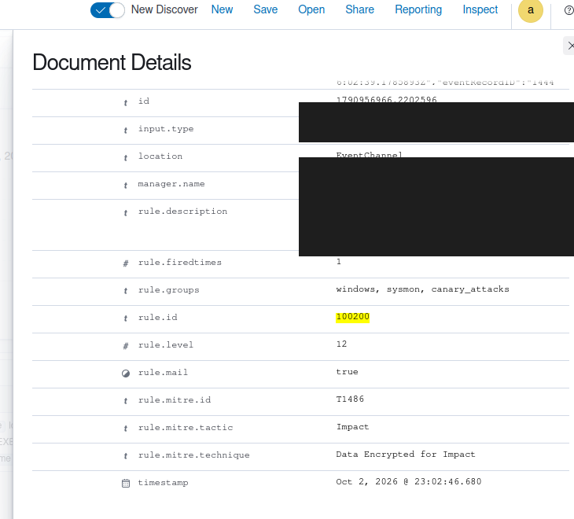
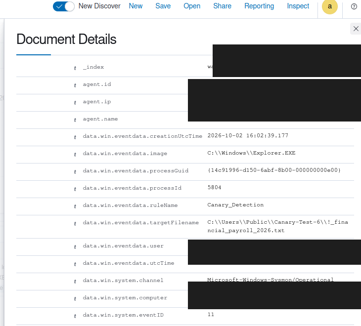

# Wazuh Detection Quality and Regression Lab

I built this lab to answer a practical SOC question: after writing a Wazuh rule, how do I know it still works and is not creating noisy alerts?

This repository is the validation companion to my [Active Directory Detection and Response Lab](https://github.com/LeeHoang26/ad-threat-detection-and-response-lab). The first project focuses on detection and response. This one focuses on testing, false positives, missing context and regression after a rule change.

## What I tested

The corpus contains 17 sanitized cases:

- 5 positive cases that should alert.
- 7 negative cases that should stay quiet.
- 5 edge cases where an analyst needs more context.

The detection set covers:

| Rule | Use case | Data source |
| --- | --- | --- |
| `100100` | Kerberoasting signal | Windows Security Event 4769 |
| `100101` | AS-REP Roasting signal | Windows Security Event 4768 |
| `100102` | Directory replication access | Windows Security Event 4662 |
| `100200` | Protected canary TXT file | Sysmon Event 11 |
| `100300` | WMI or WinRM remote shell | Sysmon Event 1 |

The questions behind the cases are more useful than the rule names. Is one RC4 ticket enough evidence? Should a Domain Controller replication event be treated like DCSync? Should a Recent-items `.lnk` shortcut be treated like a canary file write?

## Lab result

The live VMware run produced useful differences between the baseline rules and the safer candidate logic.

| Profile | TP | FP | FN | TN | Precision | Recall |
| --- | ---: | ---: | ---: | ---: | ---: | ---: |
| Baseline | 5 | 2 | 0 | 5 | 71.4% | 100% |
| Safety candidate | 5 | 1 | 0 | 6 | 83.3% | 100% |

These numbers describe this small, curated corpus. They are not production SOC metrics.

The repository also contains a live canary validation. A Sysmon Event 11 for `Canary-Test-6\!_financial_payroll_2026.txt` reached Wazuh and matched rule `100200` at level 12. The Active Response block was disabled during the test. The writer was Explorer because the test used a file copy operation, so the alert proves detection coverage and does not prove ransomware.

## Evidence

The screenshots below are sanitized copies of the live Wazuh result. IP addresses, hostnames and account names are covered before publication.





The raw `.evtx` files and the unedited screenshots stay outside this repository in a private evidence folder.

## Run it locally

The Python tools use only the standard library. Run them from the repository root:

```powershell
python scripts\generate_fixtures.py
python scripts\validate_fixtures.py
python scripts\run_regression.py --profile baseline
python scripts\run_regression.py --profile safety
python -m unittest discover -s tests
```

Expected validation output:

```text
FIXTURE VALIDATION PASSED: 17 cases
Ran 9 tests
OK
```

The generated reports are in `reports/`. The `Decision` column is an offline analyst recommendation. It does not suppress alerts or claim that a real Wazuh event was benign.

## VMware validation

The live lab uses these machines:

| Machine | Role |
| --- | --- |
| `SIEM-SRV` | Ubuntu, Wazuh Manager and Dashboard |
| `DC01` | Windows Server, Active Directory and Security events |
| `WK01` | Windows endpoint, Sysmon and Wazuh Agent |

The manual VMware walkthrough is kept outside this portfolio repository. The important live workflow is:

1. Check the Windows Event Viewer or Sysmon event.
2. Check the corresponding alert in Wazuh Discover.
3. Compare the live fields with the expected fixture.
4. Record actual results only when the exact event has passed through the Windows Agent.

Pasted JSON in Ruleset Test is useful for inspecting decoder fields. It is not a substitute for Windows EventChannel validation.

## Case studies

- [Canary shortcut scope test](docs/canary-shortcut-case-study.md) explains why a `.txt.lnk` shortcut created a noisy baseline signal and how the candidate keeps the protected `.txt` detection.
- [Methodology](docs/methodology.md) explains the corpus and metrics.
- [Tuning notes](docs/tuning-notes.md) records the investigation decisions.
- [Limitations](docs/limitations.md) records what this lab does not prove.

## Safety scope

This repository contains sanitized telemetry and detection tests. It does not disable accounts, block hosts, terminate processes or send messages. The canary Active Response handler was kept disabled while the candidate rule was validated.

The project is ready for a local review. GitHub upload is intentionally a separate step after the screenshots and README are reviewed once more.
